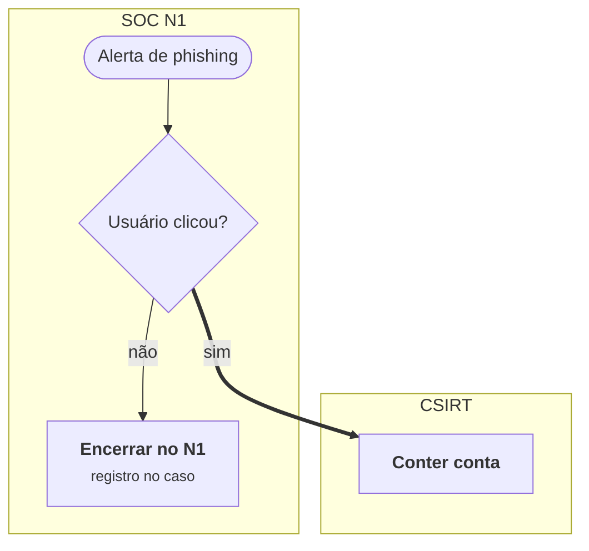

# Medusa Docs

Plataforma open source para **playbooks interativos de resposta a incidentes**: cada playbook tem um documento
(fases, passos, ramos, critérios) e um fluxograma por time, ligados entre si. O analista clica numa caixa do
fluxograma e lê o trecho do documento; o time de segurança edita tudo sem código, com perfis, ciclo de vida,
templates e auditoria.

- Só Python 3 (biblioteca padrão): nada para instalar além do Python, ou uma imagem Docker pronta.
- White label: nome, cor, logo e textos da página inicial configuráveis no painel administrativo.
- Formatos abertos: cada playbook é um `.md` + um `.drawio`; troca entre instalações em `.medusa.md` (Markdown + Mermaid).
- Versão atual: **2.0.0** (novidades em [CHANGELOG.md](CHANGELOG.md)): versionamento automático com histórico navegável,
  encaminhamento de logs em JSON com retenção, login único (SSO) por OpenID Connect.

## Instalação

### Docker (recomendado)

```bash
docker compose up -d --build
docker compose logs medusa     # mostra a senha temporária do administrador "admin"
```

Abra http://localhost:8765, entre com `admin` e a senha do log e defina a sua. Guia completo (HTTPS, backup,
atualização, variáveis): **[INSTALACAO-DOCKER.md](INSTALACAO-DOCKER.md)**.

### Python

```bash
# 1. criar o primeiro administrador (a senha é pedida no terminal, mínimo 10 caracteres)
python3 server.py adduser seu.login --role admin --name "Seu Nome"

# 2. subir o servidor
python3 server.py            # http://localhost:8765
```

Os demais usuários são criados em **⚙ Administração → Usuários**. Cada usuário novo recebe uma senha temporária,
exibida uma única vez, e precisa trocá-la no primeiro acesso.

## Primeiro acesso: o que vem configurado

- Template **Padrão**: raias SOC N1, SOC N2 e CSIRT; times de apoio de segurança (DFIR, Threat Intel, IAM,
  Vulnerabilidades, AppSec, Cloud Security, Infraestrutura, Privacidade) com descrições genéricas; ramos e um ciclo
  completo de resposta (triagem, análise, investigação, contenção/erradicação/recuperação e pós-incidente).
- Nenhum playbook: crie o primeiro em **＋ Novo playbook** ou importe um `.medusa.md`.
- Aparência padrão (nome "Medusa Docs"); ajuste em **⚙ Administração → Aparência**.

## Interface

- **Abas:** cada playbook ou página aberta vira uma aba, como num navegador (`✕` ou botão do meio fecha; `＋` abre o início). Ficam salvas no navegador de cada usuário.
- **Tema claro/escuro** no topo.
- **📖 Docs** ao lado do perfil: documentação da plataforma (uso, edição, ramos, templates, administração, operação), filtrada pelo perfil. Conteúdo em `docs.js`.
- **Aparência** (só administrador): nome exibido, cor primária (seletor, `#RRGGBB` ou R/G/B), logo (PNG, JPG, SVG ou WEBP até 512 KB) e **título e subtítulo da página inicial**. As cores do fluxograma não mudam: fazem parte do modelo dos playbooks.

## Perfis

| Perfil | Vê | Pode |
| --- | --- | --- |
| Visualizador | Playbooks em **Homologação** e **Produção** | Ler, buscar, exportar e trocar a própria senha |
| Editor | Todos, inclusive **Desenvolvimento** | Criar, editar e importar playbooks, mudar status, restaurar versões, editar templates, times e tags |
| Administrador | Todos | Tudo do editor + usuários, aparência, auditoria, logs, SSO e exclusão de playbooks e templates |

As permissões são verificadas no servidor. O visualizador nem recebe os playbooks em Desenvolvimento.

## Ciclo de vida

**Desenvolvimento → Homologação → Produção**, pelo botão "Alterar status" do playbook.

- Playbook novo ou importado começa em Desenvolvimento.
- Produção exige um **aprovador** (editor ou administrador ativo).
- **Último revisor** e **Data de revisão** são preenchidos a cada gravação. Os quatro campos ficam na tabela
  "Propriedades do playbook" do `.md` e aparecem bloqueados 🔒 no editor.

## Versionamento e histórico

| Situação | Versão | Exemplo |
| --- | --- | --- |
| Gravação em Desenvolvimento ou Homologação | soma 1 depois do ponto | 0.1 → 0.2 · 2.3 → 2.4 |
| Publicação em Produção | próxima versão cheia | 0.4 → 1.0 · 2.4 → 3.0 |
| Alteração em playbook publicado | próxima versão cheia | 1.0 → 2.0 |
| Republicar sem alteração | mantém | 1.0 → 1.0 |

A versão fica na tabela "Propriedades do playbook" (bloqueada no editor) e na linha de versão do documento. Cada
gravação guarda o conteúdo completo (`.md`, `.drawio`, vínculos) na tabela `pb_versions` do banco. A aba
**🕘 Versões** do playbook lista o histórico e permite:

- **Ler** uma versão como documentação completa, com o fluxograma clicável daquele momento (e baixar em HTML ou imprimir);
- **Comparar** duas versões (ou uma com a atual): linhas do documento e caixas/setas do fluxograma acrescentadas e removidas;
- **Restaurar** (editores) o conteúdo de uma versão, que vira uma versão nova; status e histórico são mantidos.

Visualizadores veem as versões que estiveram em Homologação ou Produção. Playbooks anteriores à 2.0 ganham um
registro inicial na primeira alteração. Excluir um playbook guarda o histórico junto (identificador `PB-xx#lixeira…`).

## Logs: encaminhamento em JSON e retenção

**⚙ Administração → Logs e retenção** (só administrador):

- **Retenção:** a auditoria é guardada por **30 dias** (padrão; ajustável de 1 a 3650). O que for mais antigo é apagado automaticamente (a cada 6 h e ao salvar), junto com os arquivos de log do período.
- **Formato:** um documento JSON por evento, no padrão Elastic Common Schema:

```json
{"@timestamp": "2026-10-05T21:02:28.526Z",
 "event": {"kind": "event", "dataset": "medusa.audit", "action": "documento_salvo", "category": ["configuration"], "outcome": "success"},
 "user": {"name": "maria.souza"}, "source": {"ip": "10.0.0.15"},
 "medusa": {"target": "PB-01", "detail": {"versao": "0.2"}},
 "service": {"name": "Medusa Docs", "type": "medusa-docs", "version": "2.0.0"}, "host": {"hostname": "medusa"}}
```

| Destino | Como funciona |
| --- | --- |
| HTTP / HTTPS | POST de um array JSON por lote (até 200), cabeçalho de autenticação opcional, até 3 tentativas |
| Syslog | RFC 5424 por UDP ou TCP (octet counting), com o JSON na mensagem |
| Arquivo | JSON Lines diário em `data/logs/audit-AAAA-MM-DD.jsonl` (Filebeat, Fluent Bit, Splunk UF) |

O envio roda em segundo plano (fila de até 10 mil eventos) e não atrasa a aplicação. Cada destino tem teste e
mostra enviados, falhas e último erro. **Baixar auditoria** exporta o período em JSON Lines (`/api/audit/export`).

## Login único (SSO)

Opcional, por **OpenID Connect** (Microsoft Entra ID, Okta, Keycloak, Google, Auth0, Authentik, ADFS 2016+):
**⚙ Administração → SSO**. Cadastre no provedor a URL de redirecionamento `https://SEU-ENDERECO/api/sso/callback`,
informe emissor, client ID, client secret e a URL pública, e ative.

- Fluxo authorization code + **PKCE**; `state` amarrado ao navegador (cookie) e `nonce`.
- **ID token validado** pela assinatura RS256 com as chaves (JWKS) do provedor, emissor, audiência, validade e nonce — sem bibliotecas externas.
- **Perfis por grupo:** claim de grupos/papéis (ex.: `groups`, `roles`, `realm_access.roles`) mapeada para Administrador, Editor ou Visualizador, reaplicada a cada login; sem grupo correspondente: Visualizador, Editor ou acesso negado.
- **Usuários:** criados no primeiro login ou só pré-cadastrados; domínios de e-mail permitidos; contas locais não são vinculadas automaticamente (convertidas pelo administrador em Usuários).
- **Login por senha** continua para todos ou só para administradores (acesso de emergência).

## Templates, times e tags

Menu do perfil → **📐 Templates, times e tags** (editor e admin). O template define o que um playbook recebe:

| Aba | O que define |
| --- | --- |
| Geral | Nome, descrição, owner e fase NIST padrão, ramos e a lista de variáveis |
| ✎ Documento modelo | Seções, tabelas e textos iniciais |
| ✎ Fluxograma modelo | Raias, caixas e setas iniciais (editor visual e modo Código) |
| Times e tags | Os times do template: centrais (podem ser raias) e de apoio/tags |

**Times e tags pertencem ao template.** Cada playbook fica ligado ao template com que foi criado (ou importado) e
usa os times dele; o cabeçalho do playbook mostra qual. Editar um time (na aba do template ou em "✎ Editar time" ao
clicar num time do playbook) vale para o template e todos os playbooks dele.

- O template **Padrão** é criado na primeira inicialização e não pode ser excluído.
- **Novo template em branco:** entrada **Alerta**, decisão "Ramo" com o ramo-modelo, seções mínimas e só os times SOC N1, SOC N2 e CSIRT.
- Na aba Times e tags: criar time, copiar de outro template ou tirar um time. Um time usado no fluxograma do template ou em playbooks dele não pode ser retirado.
- Usar num fluxograma um time de outro template o acrescenta ao template ao salvar.
- Excluir um template (só admin) o move para `data/lixeira/templates/`; os playbooks dele passam para o Padrão, que recebe os times que faltarem.
- Templates ficam em `templates/<chave>.medusa-template.md` e podem ser exportados e importados entre instalações.

**Variáveis** (substituídas na criação): `{{id}}` `{{nome}}` `{{autor}}` `{{data}}` `{{owner}}` `{{nist}}` `{{mitre}}`
`{{objetivo}}` `{{pergunta}}` `{{ramos.total}}` `{{ramos.lista}}` `{{arquivo_drawio}}`.
O que contém `{{ramo.n}}`, `{{ramo.id}}`, `{{ramo.nome}}` ou `{{ramo.pergunta}}` (subseção, linha de tabela, item,
parágrafo ou caixa do fluxograma) se repete uma vez para cada ramo informado na criação.

## Ramos sincronizados

Um ramo (R1, R2…) existe nos dois lados e fica sincronizado ao salvar (`ramos.py`):

| Lado | Forma |
| --- | --- |
| Documento | subseção `R3 · Nome` (seção "Ramos em detalhe"); o item "É sucesso quando" é o indicador |
| Fluxograma | caixa cujo texto começa com `R3` e vinculada a R3; a linha cinza é o indicador |
| Aba Ramos | lida do documento; editores criam e excluem ramos por ela |

- Criar, renomear, mudar o indicador ou excluir de um lado aplica no outro ao salvar; a notificação lista o que foi sincronizado e a auditoria registra.
- No fluxograma, a forma **Ramo** cria o próximo número, ao lado do último ramo e com as mesmas ligações.
- O servidor compara com a versão anterior do lado salvo e só remove do outro lado o que foi removido de fato.
- O texto "R1 a Rn" é atualizado sozinho.

## Editores

- **Documento:** seções, subseções, parágrafos, listas, checklists, destaques e tabelas. `Ctrl+S` salva, `Ctrl+B` negrito, 🎯 escolhe táticas MITRE ATT&CK. **Descartar** recarrega a versão salva.
- **Fluxograma:** só as formas, cores e setas do modelo; arrastar a caixa para outra raia troca o time.
  - Texto das setas arrastável (posição gravada no `.drawio` e no Mermaid).
  - Seleção múltipla (`Shift`/`Ctrl`+clique, laço, `Ctrl+A`), mover em grupo, redimensionar proporcionalmente, alinhar e distribuir.
  - `Ctrl+Z` desfaz, `Del` exclui, `Ctrl+D` duplica.
- **Criar playbook:** template, identificação (autor entre os usuários), táticas MITRE ATT&CK (Enterprise v19.2, em `mitre.json`), escopo e ramos.
- Se outra pessoa salvou depois que você abriu, a gravação é recusada e a tela oferece recarregar.

## Exportar e importar

| Ação | Onde | Formatos |
| --- | --- | --- |
| Exportar um playbook (todos os perfis) | **⤓ Exportar ▾** no playbook | Markdown, HTML com fluxograma, PDF, draw.io, Mermaid, SVG, Medusa |
| Exportar todos | Página inicial | `.zip` de `.medusa.md` |
| Importar (editor) | Página inicial → **⤒ Importar** | `.medusa.md` ou `.md` comum |

O `.medusa.md` é Markdown comum com front matter, um bloco de times e o fluxograma em Mermaid: abre em qualquer
visualizador e GitHub, GitLab, Confluence (macro Mermaid) e mermaid.live desenham o fluxo. Na importação, escolha o
template do playbook; times citados no arquivo que faltarem são acrescentados a ele. O playbook entra em Desenvolvimento.

## Fluxograma em texto (Mermaid)

No editor de fluxograma, **</> Código** mostra o fluxo como texto; edite e clique em **Aplicar ao desenho**.



| Escrita | Significado |
| --- | --- |
| `subgraph id["Time"] … end` | Raia |
| `a(["…"])` / `a["…"]` / `a{"…"}` | Início / ação / decisão |
| `:::close` `:::neutral` `:::attention` `:::crossref` `:::support` | Encerramento, vínculo/descarte, ponto de atenção, outro playbook, apoio |
| `-->` · `-.->` · `==>` · `\|rótulo\|` | Fluxo · tracejada (handoff, apoio ou referência) · escalonamento · rótulo |
| `%% @refs a T0, R1` | O que o analista lê ao clicar |
| `%% @pos a x y l a` · `%% @route a>b …` · `%% @label a>b dx,dy` | Posição, dobras e texto da seta (opcionais) |

## Segurança

| Item | Como funciona |
| --- | --- |
| Senhas | PBKDF2-SHA256 (310 mil iterações) |
| Sessão | Cookie `HttpOnly` + `SameSite=Strict`; no banco só o SHA-256 do token; expira após 8 h sem uso |
| Login | Bloqueio de 5 min após 5 tentativas erradas |
| Requisições | Alterações exigem o cabeçalho `X-Requested-With` (anti-CSRF) |
| Navegador | CSP sem script inline, `X-Frame-Options`, `nosniff`; logo servida em sandbox |
| Arquivos | Só o front-end é servido; `.md`, `.drawio`, banco e backups não ficam acessíveis pela web |
| Docker | Usuário sem privilégios (UID 10001), sistema de arquivos somente leitura, sem capabilities |
| Auditoria | Login, gravações (com a versão), status, criação, importação, exportação, exclusão, templates, times, usuários, aparência, logs e SSO; IP de origem; retenção de 30 dias e encaminhamento em JSON |
| SSO | OpenID Connect com PKCE, state e nonce; ID token validado pela assinatura RS256, emissor, audiência e validade |

Para expor na rede, publique atrás de um proxy reverso com HTTPS e use `--secure-cookies` (ou `MEDUSA_SECURE_COOKIES=1`).

## Dados

Tudo fica em `MEDUSA_HOME` (padrão: a pasta da aplicação; no Docker, o volume `/data`):

| Caminho | O que é |
| --- | --- |
| `playbooks/PB-xx-*/` | `.md` e `.drawio` de cada playbook |
| `mappings.json` | Caixa do fluxograma → passos, ramos ou seções |
| `templates/` | Templates, com os times e tags de cada um |
| `data/playbooks.db` | SQLite: usuários, sessões, tentativas de login, auditoria, configurações (aparência, logs, SSO), template e histórico de versões de cada playbook |
| `data/logs/` | Auditoria em JSON Lines, quando o destino "arquivo" está ligado |
| `data/lixeira/` | Playbooks e templates excluídos |
| `.backups/<PB>/<data-hora>/` | Versão anterior de cada arquivo, guardada a cada gravação |

**Backup:** copie a pasta inteira (com o servidor parado) ou use `sqlite3 data/playbooks.db ".backup copia.db"` para o banco com ele rodando.
Novas versões do esquema do banco são aplicadas sozinhas ao iniciar (`MIGRATIONS` em `store.py`).

## Variáveis de ambiente

| Variável | Padrão | Uso |
| --- | --- | --- |
| `MEDUSA_HOME` | pasta da aplicação | Pasta de dados |
| `MEDUSA_HOST` / `MEDUSA_PORT` | `127.0.0.1` / `8765` | Endereço e porta |
| `MEDUSA_SECURE_COOKIES` | `0` | `1` atrás de HTTPS |
| `MEDUSA_TRUST_PROXY` | `0` | `1` atrás de proxy reverso: IP real do usuário pelo `X-Forwarded-For` (auditoria e bloqueio de login) |
| `MEDUSA_ADMIN_LOGIN` | — | Cria o administrador inicial se não houver nenhum |
| `MEDUSA_ADMIN_NAME` | `Administrador` | Nome do administrador inicial |
| `MEDUSA_ADMIN_PASSWORD` | gerada | Senha inicial (sem ela, uma temporária aparece no log); a troca é obrigatória no primeiro acesso |

Para testar sem mexer nos dados reais, aponte `MEDUSA_HOME` para uma cópia.

## Estrutura do código

| Arquivo | Função |
| --- | --- |
| `server.py` | Servidor HTTP, API, permissões, CLI `adduser` |
| `store.py` | Banco SQLite (usuários, sessões, auditoria, configurações, versões) |
| `logfwd.py` | Encaminhamento de logs em JSON (HTTP, syslog, arquivo) e retenção |
| `sso.py` | Login único por OpenID Connect (PKCE, validação RS256 do ID token) |
| `pbcore.py` | Leitura e escrita de `.md` e `.drawio`, layout, governança |
| `templates.py` | Templates, template Padrão, times por template, criação de playbooks |
| `ramos.py` | Sincronização de ramos entre documento e fluxograma |
| `flowdsl.py` | Fluxograma ⇄ Mermaid |
| `bundle.py` | Formato de troca `.medusa.md` |
| `index.html`, `app.js`, `editor.js`, `flow.js`, `docs.js`, `style.css`, `theme.js` | Interface |

## Licença

[MIT](LICENSE) © 2026 Gabriel Flauzino. Uso, cópia, modificação e distribuição livres, inclusive comercial, desde que o aviso de copyright e a licença acompanhem as cópias.
